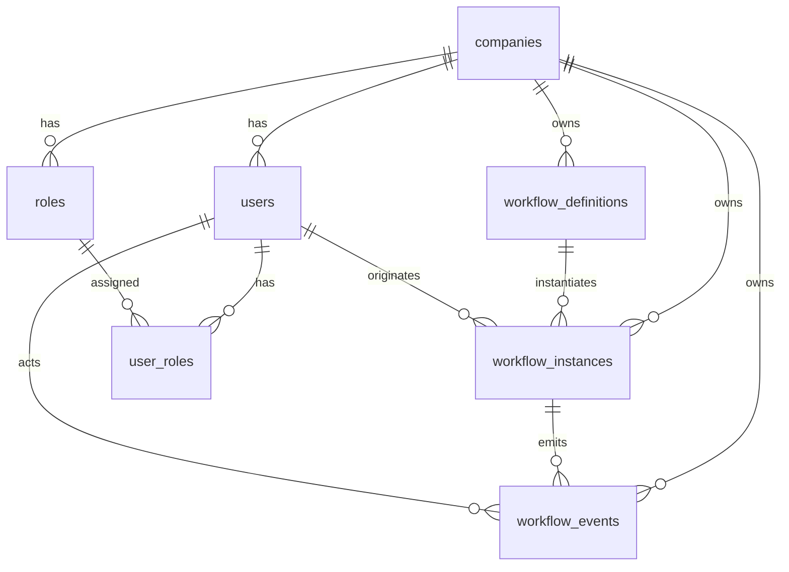

# WizFlow — Entity Relationship (P0 core)

```mermaid
erDiagram
    companies ||--o{ users : has
    companies ||--o{ roles : has
    companies ||--o{ workflow_definitions : owns
    companies ||--o{ workflow_instances : owns
    companies ||--o{ workflow_events : owns

    users ||--o{ user_roles : has
    roles ||--o{ user_roles : assigned

    workflow_definitions ||--o{ workflow_instances : instantiates
    workflow_instances ||--o{ workflow_events : emits
    users ||--o{ workflow_instances : originates
    users ||--o{ workflow_events : acts
```

Org entities (departments, branches, employees, approval_limits) land in **P1**.
